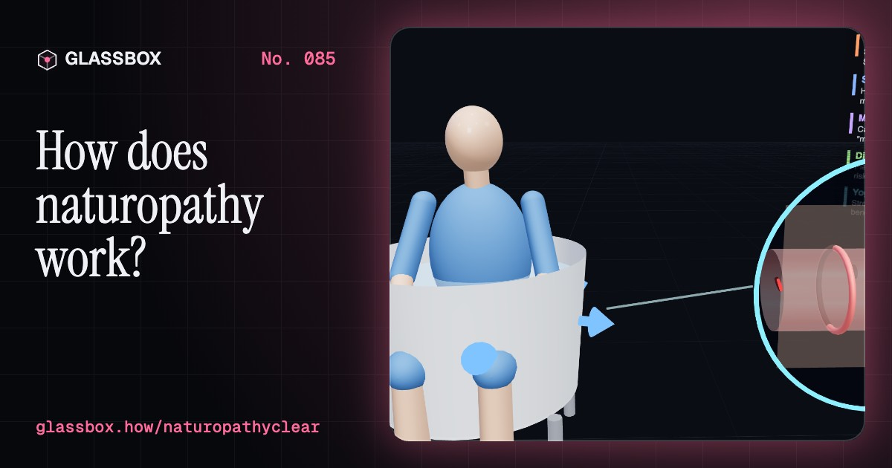
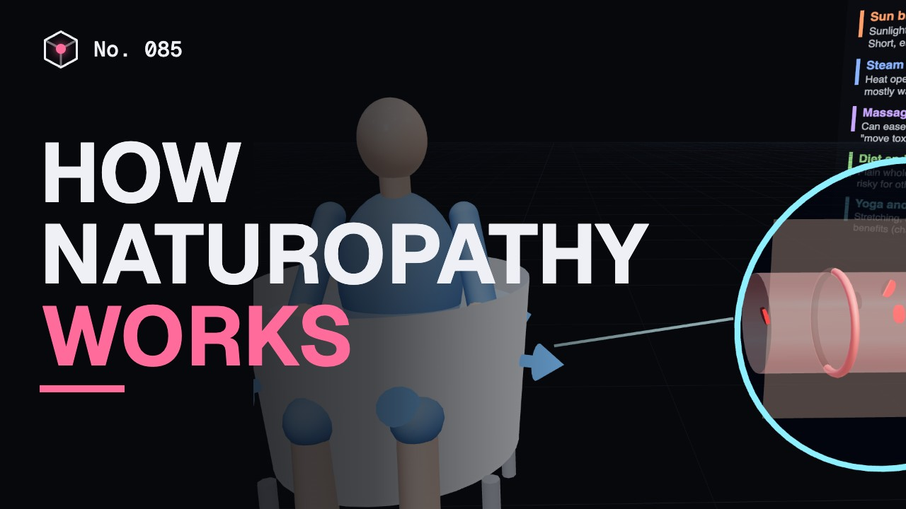
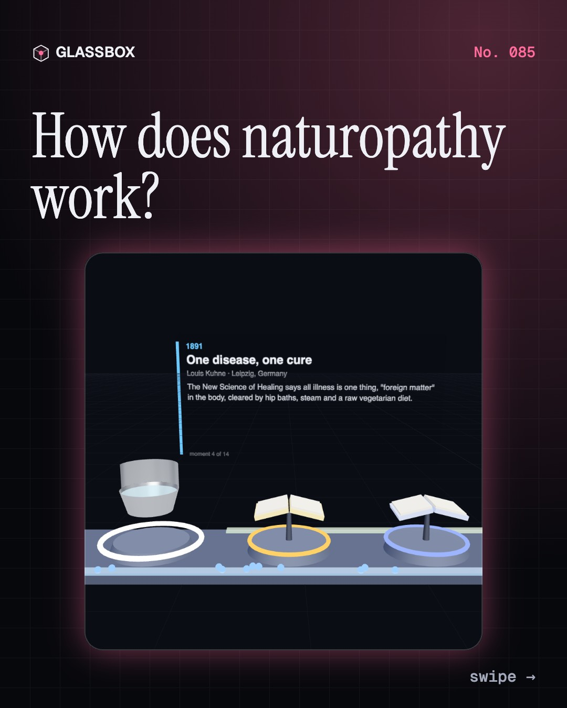
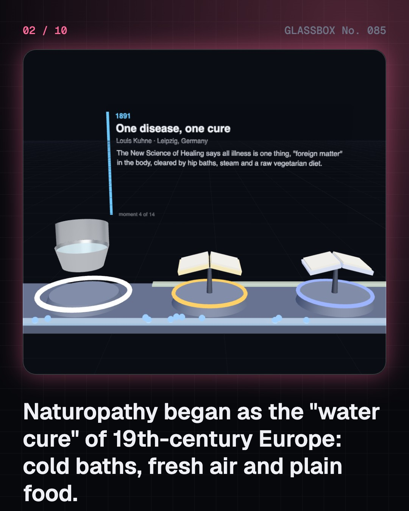
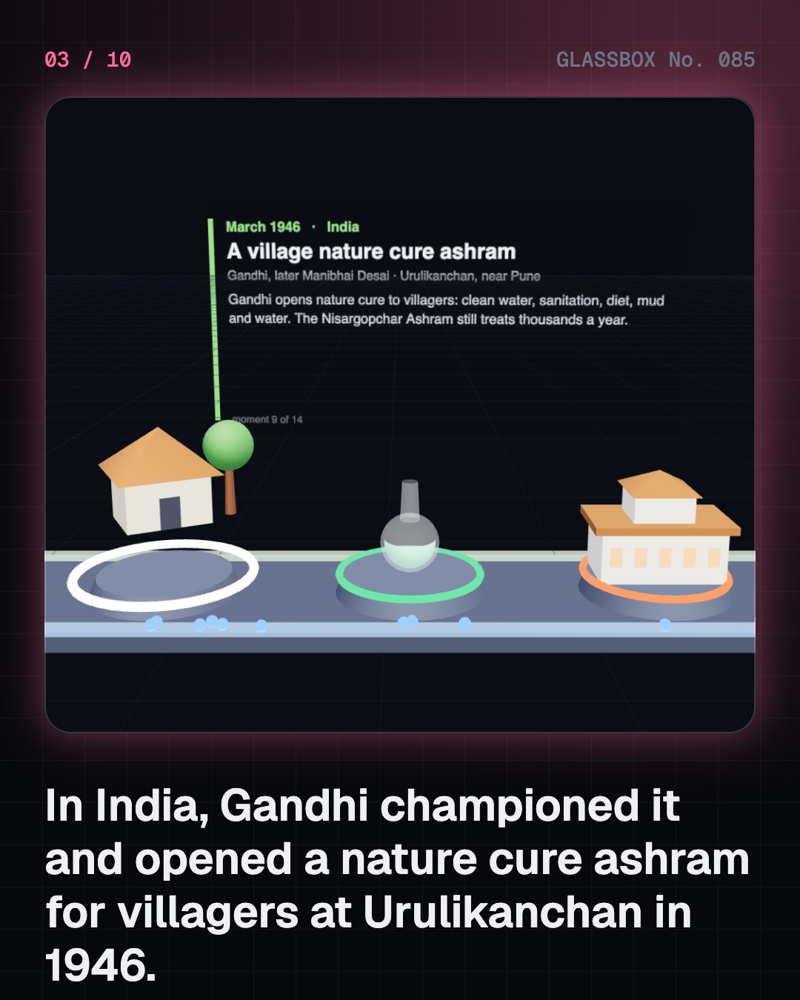
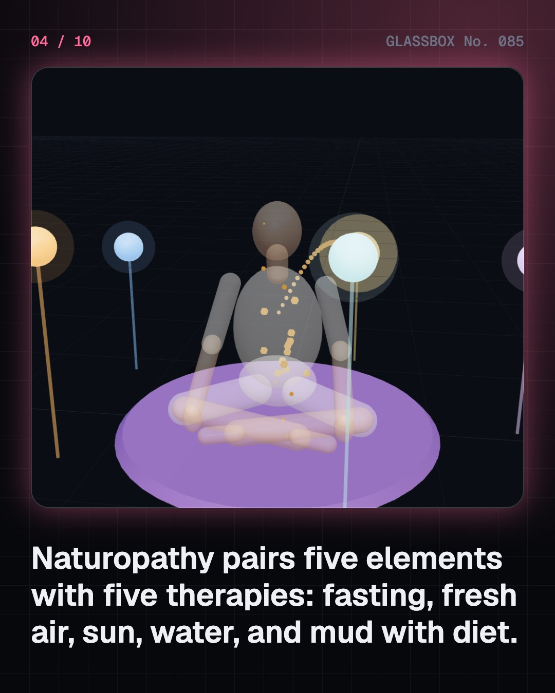

<!-- glassbox:start -->
<!-- Generated from glassbox.json by the Glassbox hub (npm run readme -- naturopathyclear). Edit glassbox.json, not this block. -->
<p align="center"><a href="https://glassbox.how/e/naturopathyclear/"></a></p>

<h1 align="center">NaturopathyClear</h1>

<p align="center"><b>How does naturopathy work?</b><br>Hip baths, mud packs, fasting and sunshine: naturopathy heals without medicines, and Gandhi was its biggest fan. Walk its 200-year story from a Silesian water cure to Urulikanchan, see its five-element model as it tells it, then watch what hot water, cold water and a 3-day fast really do inside you, and where the evidence stands.</p>

<p align="center"><a href="https://glassbox.how/naturopathyclear/"><b>▶ Play with it</b></a> &nbsp;·&nbsp; <a href="https://glassbox.how/e/naturopathyclear/">Read the 60-second explainer</a> &nbsp;·&nbsp; <a href="https://glassbox.how/naturopathyclear/glassbox/reel.mp4">Watch the 40-second video</a></p>

<p align="center">
  <a href="https://glassbox.how/e/naturopathyclear/"></a>
  <a href="https://glassbox.how/e/naturopathyclear/"></a>
  <a href="LICENSE"></a>
  <a href="LICENSE-CONTENT.md"></a>
  <a href="#privacy"></a>
</p>

## In 60 seconds

1. **From water cure to village ashram.** Nature cure began with Priessnitz's cold-water spa (1822), Kneipp's My Water Cure (1886) and Kuhne's 'one disease, one cure' (1891). Kuhne reached India in Telugu around 1894. Gandhi championed it, wrote Key to Health and opened a village ashram at Urulikanchan in 1946. Today it is the N in AYUSH, with CCRYN (1978), NIN Pune (1986), the BNYS degree and Naturopathy Day on 18 November.
2. **Five elements, as naturopathy tells it.** Naturopathy pairs the five elements with therapies: space with fasting, air with air baths and pranayama, fire with sun baths, water with hydrotherapy, earth with mud and diet. It holds that the body heals itself once 'foreign matter' is cleared through skin, lungs, kidneys and bowels. That load is an idea, not something a lab measures.
3. **What water really does.** Cold water narrows skin blood vessels and hot water opens them wide. Because flow grows with the radius to the fourth power, a vessel 1.6 times wider carries about 7 times the blood. A hip bath moves tens of watts of heat, but your core barely changes. Below about 15 °C, a full plunge triggers cold shock.
4. **Where it meets good science.** Healthy-living parts hold up. In trials of people with high blood pressure, brisk exercise lowers the top number by about 8 mmHg, less salt by about 5 and a plant-rich plate by about 11. Yoga helps by about 4, with weaker studies. ICMR-NIN's 2024 guidelines say at most 5 g of salt a day.
5. **Fair tests, fasting and detox.** In a fast the liver's sugar store runs low within a day, then new glucose and ketones keep a healthy adult steady. On insulin, or in pregnancy, fasting can be dangerous. Your kidneys already filter about 180 litres of plasma a day; no good trial shows detox diets remove toxins.
6. **Using it wisely.** Keep the good habits: sleep, daily movement, vegetables, less salt and sugar, fresh air and calm. Use nature cure alongside medicine, never instead of it for serious illness, and never stop insulin, blood-pressure or other prescribed medicines. Chest pain, stroke signs or fainting need a qualified doctor now.

## Words worth knowing

| Term | Meaning |
|---|---|
| **Naturopathy** | A drug-free system of healing that uses diet, fasting, water, mud, sun, air, massage and exercise. |
| **Pancha mahabhuta** | The five great elements, space, air, fire, water and earth, that naturopathy says make up the body. |
| **Vis medicatrix naturae** | 'The healing power of nature': the belief that the body tends to heal itself. |
| **Hydrotherapy** | Treatment with water at different temperatures, such as hip baths, foot baths, packs and steam. |
| **Vasodilation** | Blood vessels widening, which sends more blood to the skin, as in a hot bath. |
| **Gluconeogenesis** | The liver making new glucose during a fast, once its glycogen store runs low. |
| **Ketones** | Fuels the liver makes from fat when food is scarce; the brain can use them. |
| **Placebo effect** | Feeling better because you expect to, which is why fair tests compare against a control group. |
| **BNYS** | Bachelor of Naturopathy and Yogic Sciences, India's 5½-year degree in naturopathy and yoga. |

## A short history

**200 years from a Silesian water cure to Gandhi's village ashram and India's Naturopathy Day.**

- **1822** · A farmer's water cure (Vincenz Priessnitz, Gräfenberg, Silesia (now Lázně Jeseník))
- **1886** · My Water Cure (Sebastian Kneipp, Wörishofen, Bavaria)
- **1891** · One disease, one cure (Louis Kuhne, Leipzig)
- **1894** · Kuhne in Telugu (Dronamraju Venkatachalapathi Sarma, Andhra region)
- **1902** · Naturopathy gets its name (Benedict Lust, New York)
- **1942** · Key to Health (M. K. Gandhi, Aga Khan Palace, Pune)
- **1945** · A trust for nature cure (M. K. Gandhi, Pune)
- **1946** · A village nature cure ashram (M. K. Gandhi, later Manibhai Desai, Urulikanchan, near Pune)

The full story, with 27 moments, charts, people and 32 sources: [glassbox.how/e/naturopathyclear/history](https://glassbox.how/e/naturopathyclear/history/). The data lives in [`history.json`](history.json).

## Video and slides

Made with the Glassbox studio from this box's storyboard (`window.glassbox.director`). Free to reuse under CC BY 4.0.

<a href="https://glassbox.how/naturopathyclear/glassbox/video.mp4"></a>

<p><a href="glassbox/slide-1.jpg"></a> <a href="glassbox/slide-2.jpg"></a> <a href="glassbox/slide-3.jpg"></a> <a href="glassbox/slide-4.jpg"></a></p>

| File | What | Size |
|---|---|---|
| [`glassbox/reel.mp4`](https://glassbox.how/naturopathyclear/glassbox/reel.mp4) | Reel / Short, with captions and soundtrack | 1080×1920 |
| [`glassbox/video.mp4`](https://glassbox.how/naturopathyclear/glassbox/video.mp4) | YouTube video, with captions and soundtrack | 1920×1080 |
| `glassbox/slide-1…10.jpg` | Instagram carousel | 1080×1350 |
| `glassbox/thumb.jpg` | YouTube thumbnail | 1280×720 |
| `glassbox/cover.jpg` | Share card and repo social preview | 1200×630 |
| [`glassbox/history-reel.mp4`](https://glassbox.how/naturopathyclear/glassbox/history-reel.mp4) | “History in 10 moments” Reel / Short | 1080×1920 |
| `glassbox/history-slide-*.jpg` | History carousel | 1080×1350 |
| `glassbox/post.json` | Post copy and schedule used by the publish kit | |

## Privacy

This box has no accounts and no ads, and it ships its own fonts and libraries. When you run it yourself it sends nothing anywhere. On glassbox.how, the site's `/bar.js` also loads Glassbox's analytics: **Google Analytics** to count visits (it asks first in the EU, UK and Switzerland, and stays off when your browser sends Global Privacy Control or Do Not Track) and **ClickTrust** to detect bots.

It remembers a few things **in your own browser only**, and never sends them anywhere:

| Browser storage key | What it holds |
|---|---|
| `naturopathyclear.v1` | Which chapters you have opened, your best quiz scores, and sound on or off. |

Exactly what each one sees is at [glassbox.how/privacy](https://glassbox.how/privacy/).

## Licences

- **Code:** [MIT](LICENSE). Use it, change it, ship it.
- **Explanations, text, images and videos** (`glassbox.json`, `glassbox/`): [CC BY 4.0](LICENSE-CONTENT.md). Credit “Glassbox, glassbox.how/e/naturopathyclear”.
- **Third-party parts** keep their own licences: [three.js](https://threejs.org) (MIT), [Geist, Instrument Serif](https://openfontlicense.org) (SIL OFL 1.1).
- The Glassbox name and logo aren't covered by either licence. See the [terms](https://glassbox.how/terms/).

Found a mistake? [Open an issue](https://github.com/bdeeps/naturopathyclear/issues). Corrections happen in public.
<!-- glassbox:end -->

## Run it

It's plain HTML, CSS and JavaScript. No build step and no dependencies. Run locally, it contacts no other website.

```bash
python3 -m http.server 8000
```

Three.js and the fonts ship in `vendor/` and `fonts/`, so it also works offline.

Then open http://localhost:8000.

## How it's built

| File | What |
|---|---|
| `index.html`, `css/app.css` | The page and its styles |
| `js/app.js`, `js/stage.js`, `js/ui.js`, `js/kit.js` | The shared Glassbox 3D engine: chapters, 3D stage, controls, quiz, video director |
| `js/chapters/*.js` | One file per chapter: the 3D model, controls, text, key terms, quiz and video scenes |
| `js/nature.js` | Shared helpers: the stylised person, the five-element orbs, boards, and the physiology models (hydrotherapy heat exchange, fuel during a fast, blood-pressure effects from trials) with their sources |
| `glassbox.json` | Title, question, explainer beats, key terms, browser storage and credits shown on glassbox.how |
| `reel` in each chapter | The storyboard the Glassbox studio records into short videos |
| `glassbox/` | The published video, slides, thumbnail and post copy |
| `fonts/`, `vendor/three/` | Self-hosted Geist and Instrument Serif (SIL OFL 1.1) and three.js (MIT) |
